```{r setup, include=FALSE}
knitr::opts_chunk$set(fig.retina = 3, 
                      warning = FALSE, 
                      message = FALSE,
                      echo = F)

library(tidyverse)
```

class: white

<center>
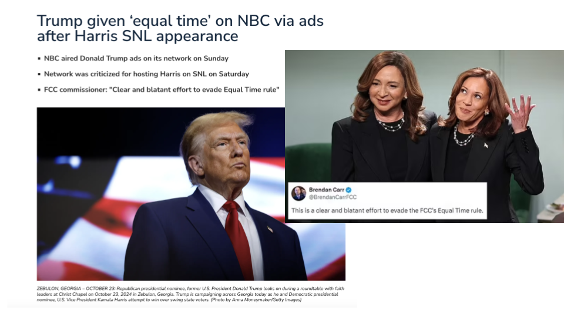
</center>


> ***Equal-time rule** mandates radio and television broadcast stations must provide equivalent access to competing political candidates

---

## Introduction

Democracy relies on the principle of *fair competition* between political candidates


<br>

.pull-left[


🏛 **Campaign rules aimed to level the field**:
  + 🇺🇸 *Equal-time rule* 📡 *(US)*
  + 🇫🇷 *Equal airtime law* 📺 *(France)*
  
+ 💰 Campaign finance laws regulate spending to prevent undue influence


]

.pull-right[

<center>

</center>


]


<br>

> Advent of social media disrupts traditional campaigns and challenge regulations


---


class: white

<center>
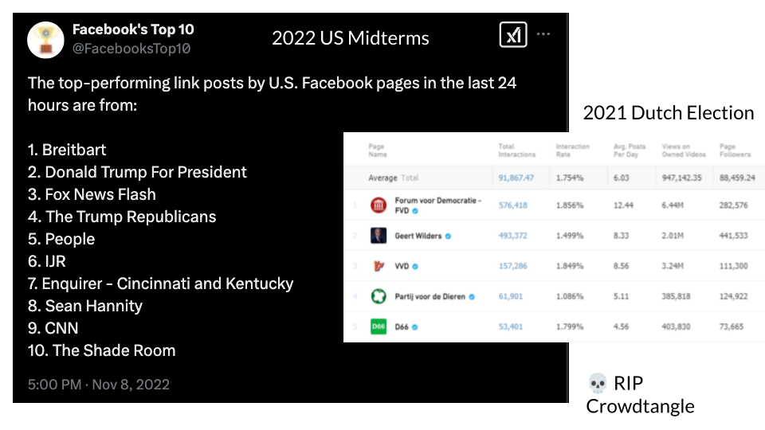
</center>


---

class: white

<center>
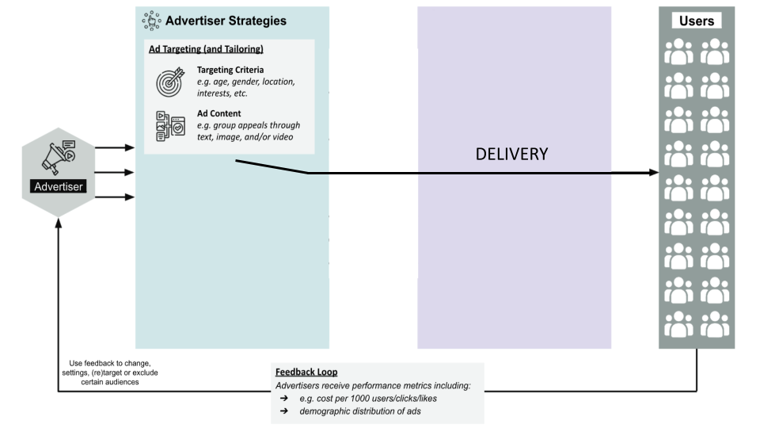
</center>


---

class: white

<center>
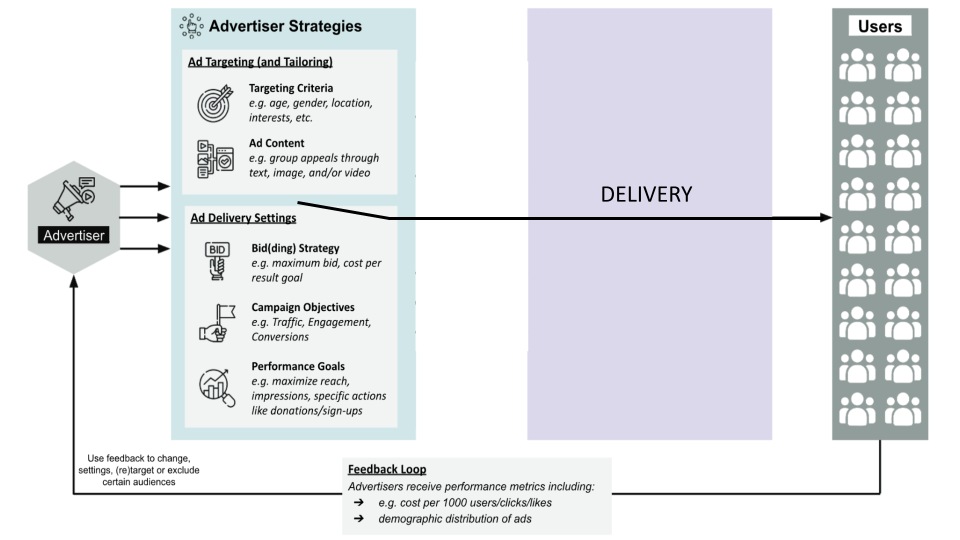
</center>


---

class: white

<center>
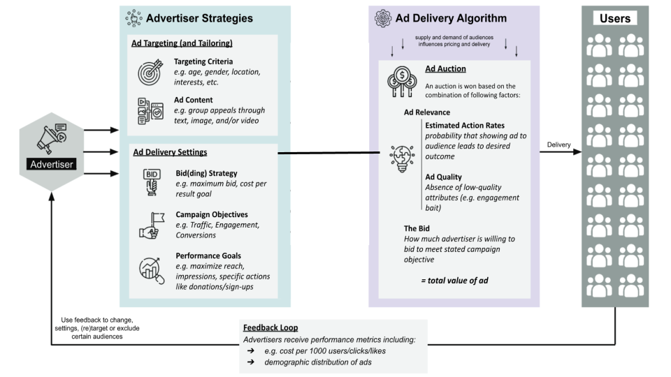
</center>


---

class: white

<center>
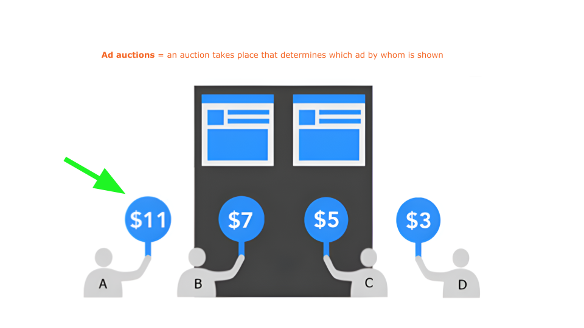
</center>


---


class: white

<center>
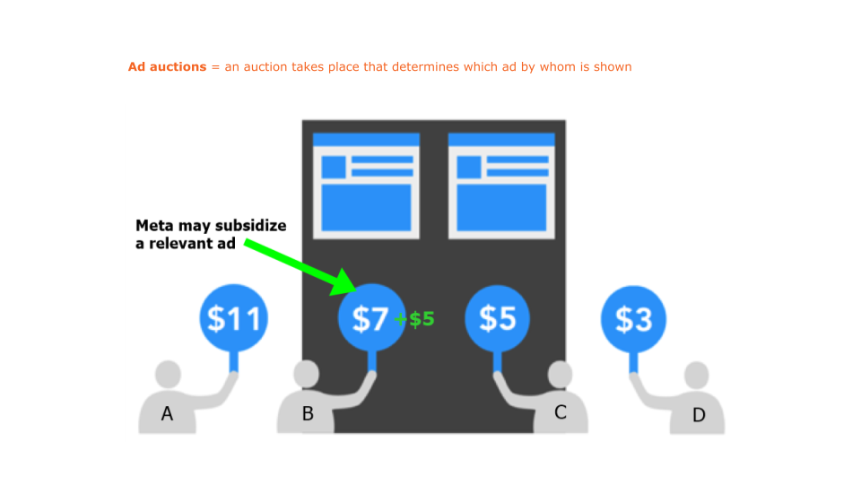
</center>


---

### Evidence of Skewed Delivery


When targeting the same audience, at the same time, with the same budget:

+ Ad delivery is heavily skewed along gendered and racial stereotypes
  + even without the intent of the advertiser [(Ali et al., 2020)](https://dl.acm.org/doi/10.1145/3359301)

--

Regarding political ads [(Ali et al., 2021)](https://dl.acm.org/doi/pdf/10.1145/3437963.3441801):

--

+ **Skewed delivery**

  + Political ads more often delivered to ideologically congruent audience 
      + Bernie ads → higher % D; 
      + Trump ads → higher % R

--

+ **Increased cost**

  + Liberal ad to a liberal audience: *21 Dollar per 1000 users*; 
  + Conservative ad delivered to liberal audience: *40 Dollar per 1000 users*.


---

class: white

### Evidence of Uneven Playing Field

<center>
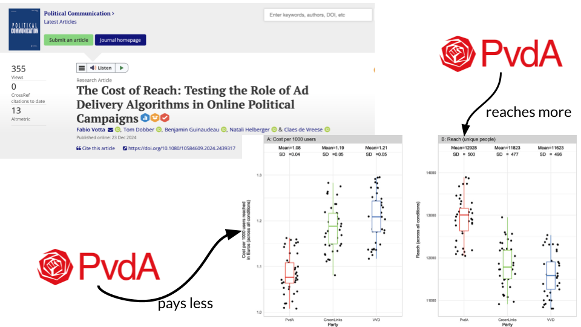
</center>

---

class: white

<br>
<br>


<center>

</center>


---

## **Research Aim**

- 🎯 In this study, we explore the **pricing of political advertisements** on Facebook  
- 🌍 Examining **cross-country** and **party** differences during the 2024 European Parliament Elections

.center[
**RQ1**: Do prices for political ads differ across _countries_ and _parties_?  

**RQ2**: What factors influence the price of political advertisements *between* parties?  
]

<center>

</center>


---

### **Pre-Registered Hypotheses**

.center[
> **RQ1**: Do prices for political ads differ across _countries_ and _parties_?  
]

<br>

--

<br>

.center[

📌 **H1**: The price for political advertisements differs across countries. 
]

<br>

--


.center[

📌 **H2**: Political parties are charged different prices for the same political ads.  
]


---

### **Exploratory Analysis**

> **RQ2**: What factors influence the price of political advertisements *between* parties?  


.center[
#### 📱 **Account Factors**  
 Characteristics of the Facebook accounts placing ads  
 e.g. follower count & past ad spending  
]


--

.center[
#### 🏛️ **Party Factors**  
 Characteristics of the party placing ads  
 e.g. support level & voter demographics  
]

--

.center[
#### 📊 **Market Factors**  
 Characteristics of the market environment in which ads are placed  
 e.g. audience demand & advertiser competition  
]


---

class: white

.font120[*35* parties in 8 countries placed **identical ads with the same settings**]


<center>
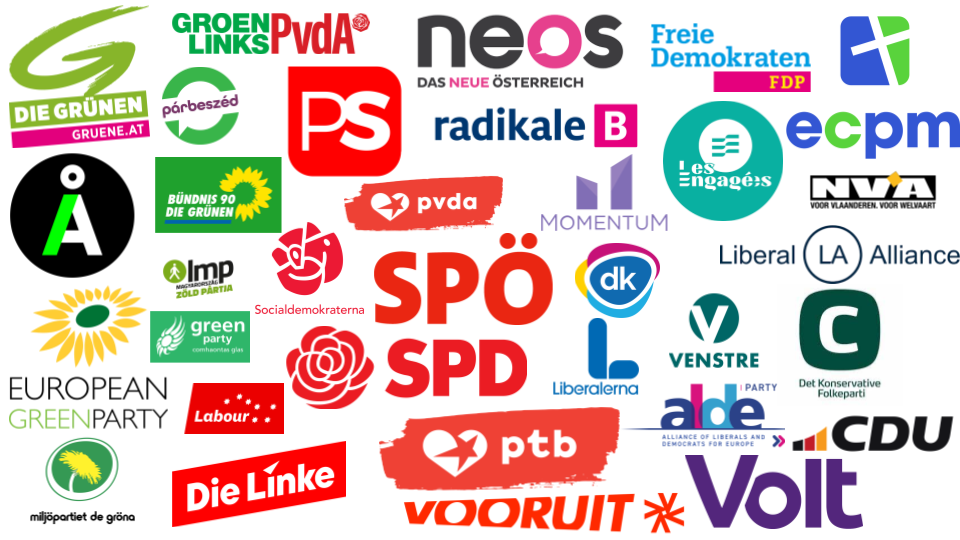
</center>

Germany, Denmark, Austria, Belgium, Sweden, Ireland, Hungary, Netherlands

---

class: white

.font120[*30* parties in 8 countries placed identical ads with the same settings **at the same time**]


<center>
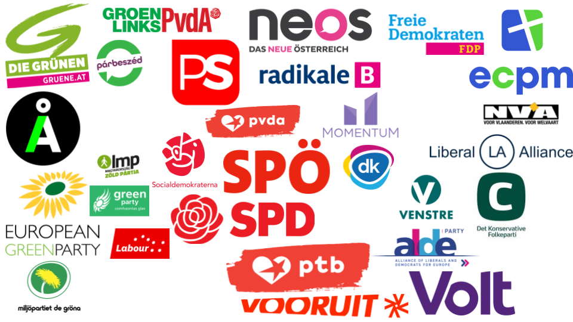
</center>

Germany, Denmark, Austria, Belgium, Sweden, Ireland, Hungary, Netherlands

---

class: white

.font120[*30* parties in 8 countries placed identical ads with the same settings **at the same time**]


<center>
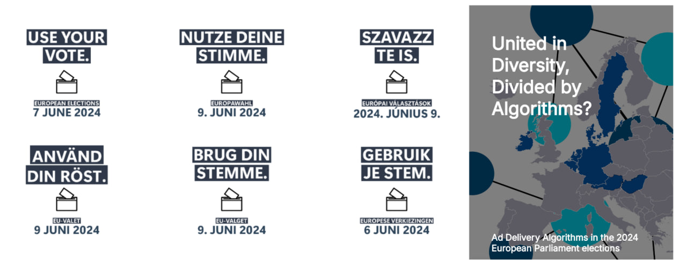
</center>

.pull-left[
**💰 Budget & Timing**
- €1/day for 7 days  
- 📅 Start Date: *April 29, 2024*  
- 📊 Outcome Measured: *Cost per 1k users*  
]

.pull-right[
**🎯 Targeting Conditions**
- 🚫 No Targeting 
- 📢 Interested in Politics   
- 🎓 Below-University Education 
]

---

class: white

#### Do prices differ between countries? (RQ1)

<center>
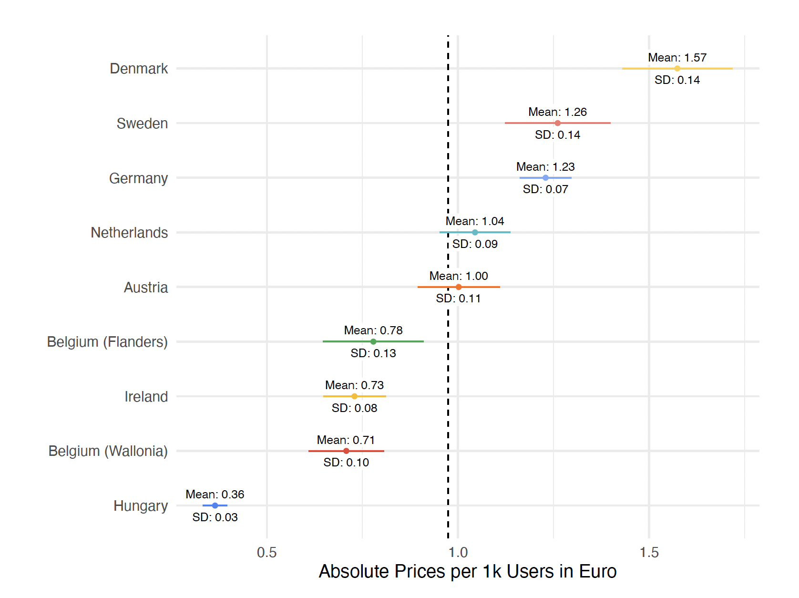
</center>

+ **High variance across countries** (49% on average, 321% max.)

---

class: white

#### Do prices differ between parties? (RQ1)

<center>
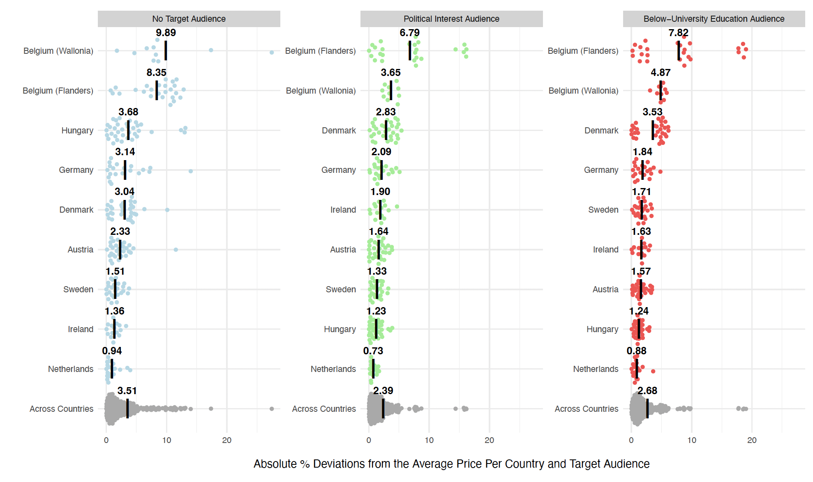
</center>

+ **Within-country differences:**
  + 4% average variation (max. 27%)
  + Even *"small"* differences can lead to thousands of additional unique people reached

---

class: white

#### Do prices differ between parties? (RQ1)

<center>

</center>

+ **Most variation with "No Targeting"**
  + Algorithm more free → more bias
  
---

class: white


### What Drives Price Differences? (RQ2) - Account-Level

<center>
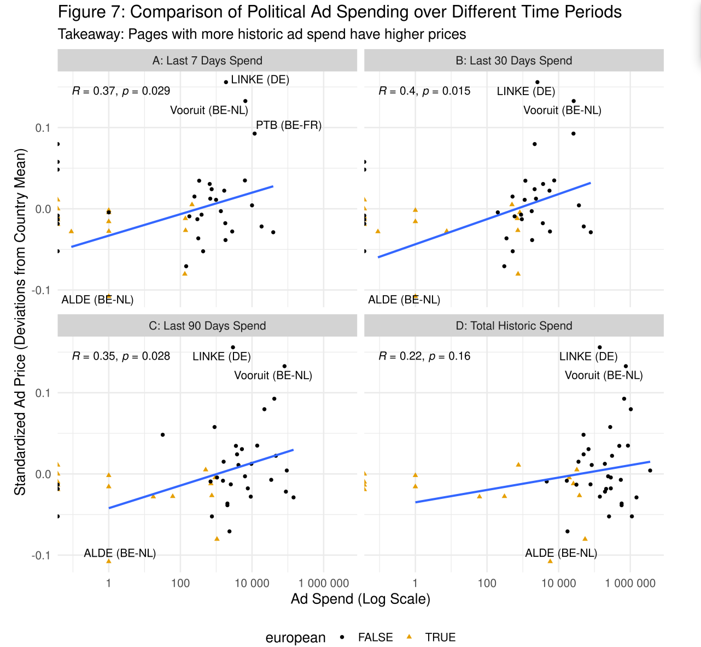
</center>

---

class: white

### What Drives Price Differences? (RQ2) - Party-Level

<center>
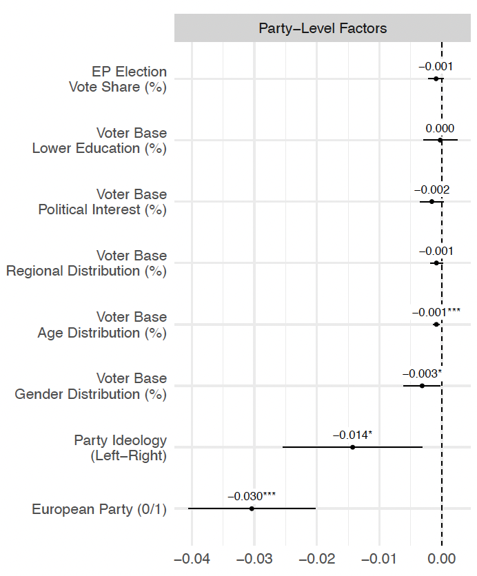
</center>

---

class: white

### What Drives Price Differences? (RQ2) - Market-Level

<center>
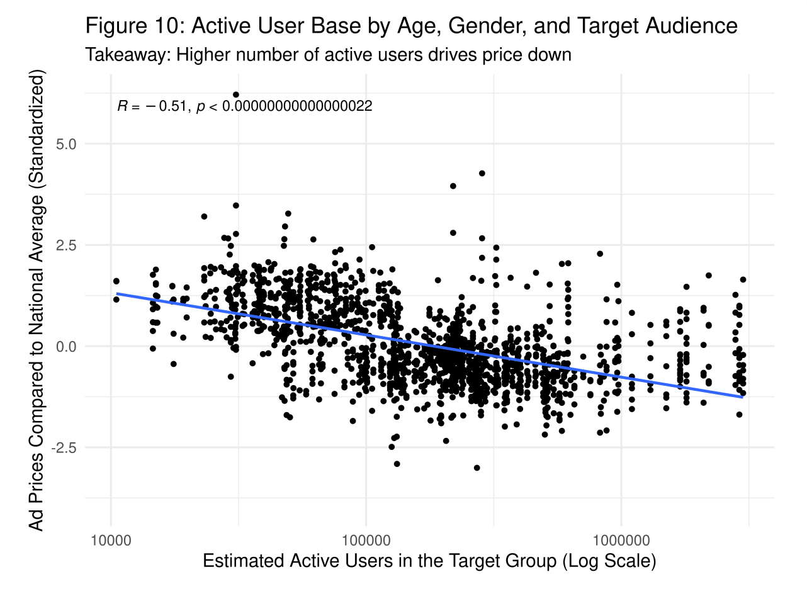
</center>

---

## Conclusion

+ Ad delivery algorithms (unintentionally?) favor some political actors

--

+ Within-country price variation:
  + Average 4% (max. 27%)
  + Significant exposure bias leads to thousands of differential reach

--

+ Key drivers:
  + Audience size
  + Spending history
  + Ideology (?)
  + Supranational parties (?)

--

+ Calls for regulatory attention to preserve an equal playing field:

+ Algorithmic access for researchers to audit independently 

---

class: middle, center

# **Thank You for Listening!** Questions? 🎤  

<div style="text-align: center;">
    <div style="display: inline-block; text-align: left;">
        <p align="left">
            `r icons::icon_style(icons::fontawesome("link"),fill="black")`&nbsp;
            <a href="https://favstats.github.io/etmaal2025">favstats.github.io/etmaal2025 (Slides)</a> <br>  
            `r fontawesome::fa("bluesky", fill = "blue")`&nbsp; @favstats.eu <br>  
            `r icons::icon_style(icons::fontawesome("mastodon"),fill="#615ff7")`&nbsp; @favstats@fosstodon.org  
        </p>
    </div>
</div>

<br>
<br>

**United in Diversity, Divided by Algorithms?**

A Cross-National Examination of ***Ad Delivery Algorithms*** during the 2024 European Parliament Elections

*Fabio Votta, Simon Kruschinski, Mads Fuglsang Hove, Anamaria Dutceac Segesten, Márton Bene, Christina Gahn, Linn Sandberg, Jan Zilinsky, Claes de Vreese, James P. Cross, Ruth Dassonneville, Tom Dobber, and Benjamin Guinaudeau*


